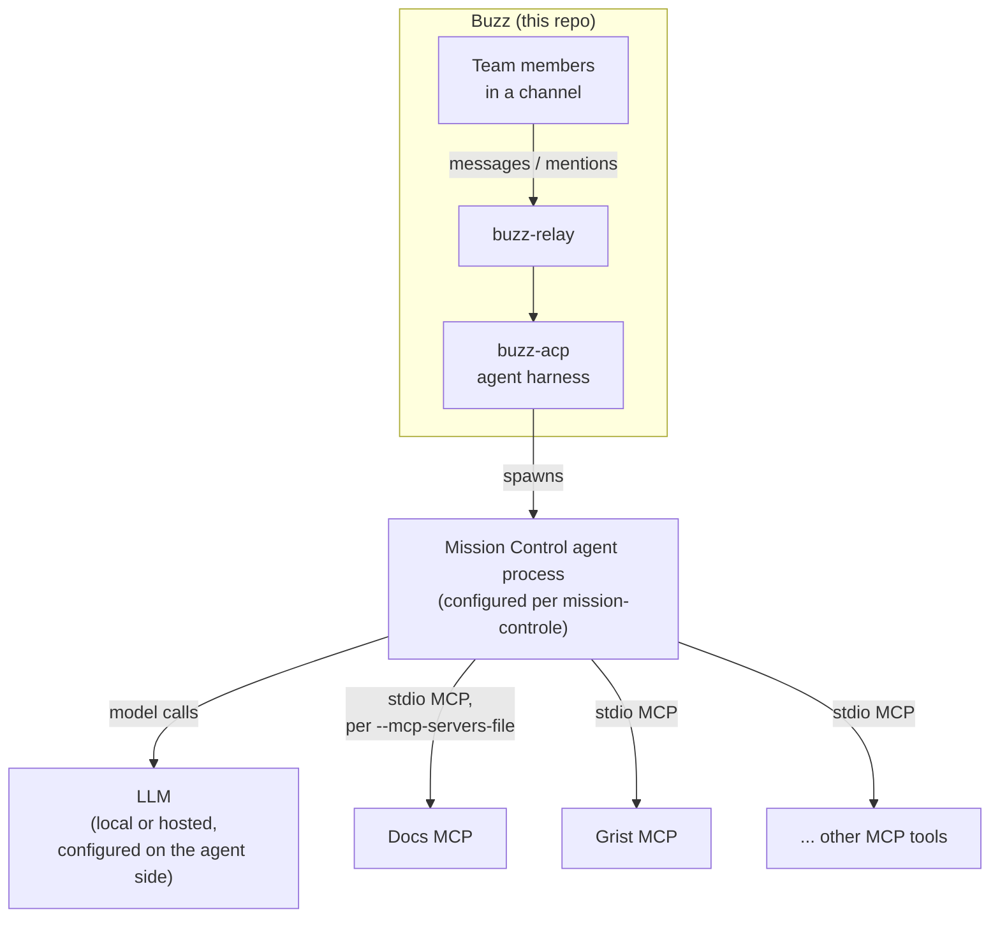

<h1 align="center">Buzz × Mission Control</h1>

<p align="center">
  <strong>This is a fork of the open-source <a href="https://github.com/block/buzz">Buzz</a> project, extended during the DINUM × 42 Hackathon 2026 to carry <a href="https://github.com/NewbieCae/mission-controle">Mission Control</a>.</strong>
</p>

<p align="center">
  <b>Un channel. Une équipe. Un agent IA. Tous leurs outils.</b>
</p>

<p align="center">
  <a href="#what-is-mission-control">Mission Control</a> ·
  <a href="#why-buzz">Why Buzz</a> ·
  <a href="#what-we-added">What we added</a> ·
  <a href="#architecture">Architecture</a> ·
  <a href="#repository-relationship">Repos</a> ·
  <a href="#upstream-buzz">Upstream</a> ·
  <a href="LICENSE">Apache 2.0</a>
</p>

---

This repository is **not our original product**. Buzz is an existing
open-source collaborative workspace built by [Block, Inc.](https://block.xyz).
We forked it and made one focused addition on the `mission-control-mvp`
branch: a way for a Buzz-hosted agent to load an arbitrary set of MCP tool
servers from a config file, so a single shared agent — Mission Control — can
sit in a Buzz channel and reach several tools at once.

The rest of what makes Mission Control an "agent," how it reasons, and how it
talks to Docs and Grist, lives in a separate repository:
**[NewbieCae/mission-controle](https://github.com/NewbieCae/mission-controle)**
(branch `feat/mission-control-ai`). This fork is the collaborative surface it
runs inside of, not the orchestration core itself.

---

## What is Mission Control?

Most AI assistants live in a private window next to the work: one human, one
chatbot, no shared context. Mission Control flips that around.

```
HUMAN ↔ HUMAN ↔ MISSION CONTROL
```

Several teammates talk in the same Buzz channel, and Mission Control
participates in that channel as an agent — same room, same thread, same
audit trail — instead of as a side conversation only one person can see.
*The AI is no longer in a separate window next to the work. It becomes part
of the team.*

The orchestration logic — how Mission Control plans, calls tools, and talks
to Docs/Grist — is maintained in the core repository:

**[github.com/NewbieCae/mission-controle](https://github.com/NewbieCae/mission-controle)** (`feat/mission-control-ai`)

This README does not duplicate that project's docs; see it for the full
picture.

---

## Why Buzz?

Buzz is a self-hostable Nostr relay with a chat-shaped client on top: every
message, reaction, and agent action is a signed event in one log, and agents
can join channels as members with their own keys — not as bots bolted onto
webhooks. That's an upstream Buzz property, not something we built, and it's
exactly the surface Mission Control needed: a real multi-human channel that
an agent can be a first-class participant in, with `buzz-cli` giving that
agent a JSON-in/JSON-out way to read and post in the room.

We didn't create this capability. We used it as the collaborative interface
for Mission Control.

---

## What we added

Everything below is scoped to the `mission-control-mvp` branch (diffed
against this fork's `main`, one commit). Nothing here is upstream Buzz work.

- **Multiple MCP servers per agent.** Buzz's agent harness (`buzz-acp`)
  previously wired at most one MCP tool server per agent
  (`--mcp-command` / `BUZZ_ACP_MCP_COMMAND`). We added a second, additive
  mechanism: **`--mcp-servers-file`** / **`BUZZ_ACP_MCP_SERVERS_FILE`**, which
  points at a JSON file declaring a list of stdio MCP servers
  (`{name, command, args, env}`). Both mechanisms can be used together.
- **Credential isolation by design.** The legacy `--mcp-command` server
  still auto-receives Buzz's own credentials
  (`BUZZ_PRIVATE_KEY` / `BUZZ_RELAY_URL` / `BUZZ_AUTH_TAG`) because it's
  trusted, in-repo tooling. Servers loaded from `--mcp-servers-file` are
  treated as **external and untrusted by default** — they receive only the
  environment variables each entry explicitly lists, never Buzz's keys.
- **Reserved-key protection.** `BUZZ_ACP_MCP_SERVERS_FILE` was added to the
  desktop app's list of reserved environment keys, so a managed agent's
  launch config can't silently override it — the same treatment already
  given to `BUZZ_ACP_MCP_COMMAND`.
- **A one-line prompt clarification** in `base_prompt.md`: `buzz` is a CLI
  binary, not a tool name — invoke it through the shell tool.
- **Tests** covering the new file-loading path, the credential-isolation
  boundary, and that omitting the flag changes nothing (`crates/buzz-acp/src/config.rs`,
  `crates/buzz-acp/src/lib.rs`).
- **A small, illustrative Python stub** at `examples/mission-control/` —
  dataclasses (`ActionItem`, `Decision`, `MeetingAnalysis`) sketching the
  shape of data a meeting-analysis MCP tool might produce. It's not wired
  into any Buzz code path; it's a reference for the shapes used on the
  Mission Control side.

We did **not** add an OpenAI-compatible provider, Ollama wiring, or a Gemma
config to this repository — see [Local AI](#local-ai) below for what's
actually true about model choice here.

---

## At a glance

| | Role |
|---|---|
| 💬 **Buzz** (this repo) | Shared team conversation — the channel Mission Control lives in |
| 🧠 **Mission Control** ([separate repo](https://github.com/NewbieCae/mission-controle)) | The shared agent — plans, calls tools, replies in-channel |
| 📄 **Docs** | Knowledge and reports, orchestrated from the Mission Control core |
| 📊 **Grist** | Operational tracking, orchestrated from the Mission Control core |

Docs and Grist are not part of this repository — they're tools Mission
Control reaches through MCP, from the core project.

---

## Demo flow

1. Several teammates are discussing a project in a Buzz channel.
2. Someone writes: `@Mission Control, organise le suivi.`
3. Mission Control, running as a Buzz agent, uses whichever MCP servers it's
   been configured with (declared via `--mcp-servers-file`) to act on that
   request.
4. The actual Docs/Grist workflow logic runs in the Mission Control core
   repository; this fork only carries the request into the channel and back.

---

## Architecture



`buzz-acp` is agent-agnostic — it spawns whatever binary
`BUZZ_ACP_AGENT_COMMAND` points to and, on top of the legacy single-server
path, now hands it every MCP server declared in `--mcp-servers-file`. What
that agent binary does internally (model choice, prompting, MCP-tool logic)
belongs to the Mission Control core repository.

---

## Multi-MCP support

`--mcp-servers-file <path>` (or `BUZZ_ACP_MCP_SERVERS_FILE`) points to a JSON
file listing additional stdio MCP servers for the agent. Example shape
(placeholders only — see [`.env.example`](.env.example) for the canonical
reference):

```json
[
  {
    "name": "docs",
    "command": "/path/to/docs-mcp-server",
    "args": [],
    "env": [{ "name": "DOCS_SOURCE", "value": "team-workspace" }]
  },
  {
    "name": "grist",
    "command": "/path/to/grist-mcp-server",
    "args": [],
    "env": [{ "name": "GRIST_API_URL", "value": "https://grist.example" }]
  }
]
```

These servers do **not** receive `BUZZ_PRIVATE_KEY`, `BUZZ_RELAY_URL`, or
`BUZZ_AUTH_TAG` automatically — only the `env` entries you list per server.
If you also set `--mcp-command` (the legacy single-server flag), both sets
of servers are handed to the agent together.

---

## Local AI

`buzz-acp` doesn't care what's behind the agent binary it spawns — it just
runs a process and speaks ACP/MCP to it. Model and provider choice (including
whether inference runs against a local, OpenAI-compatible endpoint) is a
property of that agent process, configured on the **Mission Control core**
side, not something this fork's code implements or hardcodes.

If your Mission Control setup runs its model locally: **primary AI inference
runs locally.** That does not mean the whole system is offline — Buzz itself
talks to a relay over the network, and any MCP tool (Docs, Grist, etc.) may
call out to its own service. See the Mission Control core repository for the
actual inference configuration.

---

## Repository relationship

| Repository | Role | Branch |
|---|---|---|
| [NewbieCae/mission-controle](https://github.com/NewbieCae/mission-controle) | Orchestration core + MCP integrations | `feat/mission-control-ai` |
| [NewbieCae/buzz](https://github.com/NewbieCae/buzz) (this repo) | Collaborative interface + Mission Control agent integration | `mission-control-mvp` |

Both are part of the same DINUM × 42 Hackathon 2026 project. Together, these
two repositories form the complete Mission Control hackathon integration.

---

## Running the Mission Control integration

Build and run this fork the same way as upstream Buzz — see
[Quick start](#quick-start) below. To actually run Mission Control as an
agent, you additionally need:

```bash
# Point buzz-acp at whatever binary runs the Mission Control agent
BUZZ_ACP_AGENT_COMMAND=<mission-control-agent-binary>

# Declare its MCP tool servers (Docs, Grist, ...) — see Multi-MCP support above
BUZZ_ACP_MCP_SERVERS_FILE=/path/to/mcp-servers.json
```

The agent binary itself — how it's built, what model it calls, and how it
talks to Docs/Grist through MCP — is set up per the instructions in
[NewbieCae/mission-controle](https://github.com/NewbieCae/mission-controle).
This repository only provides the channel and the multi-server launch
mechanism.

---

## Security / development notes

This is a hackathon integration, not a hardened deployment. MCP servers
declared via `--mcp-servers-file` are treated as external/untrusted by
default (no automatic Buzz credentials), but running arbitrary stdio
commands as MCP servers is still process execution on your machine — only
point it at servers you trust. Production use would need proper credential
scoping and permission review beyond what a hackathon timeline allows.

---

## Current limitations

- Multi-MCP support only covers the stdio transport, and server definitions
  are static (loaded once from a file at startup, not hot-reloaded).
- The `examples/mission-control/` Python module is illustrative only — it's
  not imported or tested by anything in this repo.
- This fork carries no changes to model/provider selection; that logic lives
  entirely in the Mission Control core repository.

---

## Upstream Buzz

This repository is a fork of **[block/buzz](https://github.com/block/buzz)**,
built by [Block, Inc.](https://block.xyz) and licensed under
[Apache 2.0](LICENSE). All Mission Control-specific work described above
lives on the `mission-control-mvp` branch; everything else — the relay,
desktop/mobile clients, `buzz-cli`, the ACP harness, and the workspace model
— is upstream Buzz. See the original project's [README](https://github.com/block/buzz#readme)
and [VISION.md](VISION.md) for what Buzz is on its own terms.

---

## Quick start

Building and running this fork works exactly like upstream Buzz. You'll need
[Docker](https://docs.docker.com/get-docker/) and [Hermit](https://cashapp.github.io/hermit/)
(or Rust 1.88+, Node 24+, pnpm 10+, `just`).

```bash
git clone https://github.com/NewbieCae/buzz.git && cd buzz
git checkout mission-control-mvp
. ./bin/activate-hermit
just setup && just build
just dev   # starts the relay + desktop app together
```

See upstream's [Getting started](https://github.com/block/buzz#getting-started)
for the full range of options (packaged builds, hosted relays, Windows
prerequisites). For the agent-facing configuration specific to this fork, see
[Running the Mission Control integration](#running-the-mission-control-integration)
above.

---

## Built during

**DINUM × 42 Hackathon — 2026**

Team: Souhil · Céline · Diouf · Joudy · Shruti · Maria

---

<p align="center">
  <sub>Buzz is Apache 2.0, built by <a href="https://block.xyz">Block, Inc.</a> — this fork's Mission Control work is a hackathon contribution on top of it.</sub>
</p>
